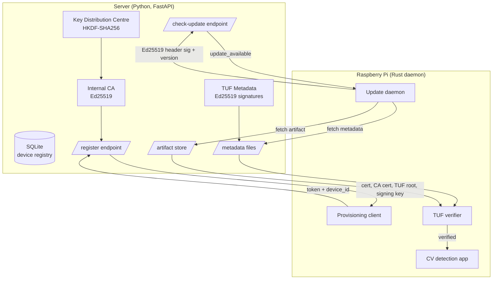

# Update Facility Manager

A secure over-the-air (OTA) update system for Raspberry Pi fleets. Devices authenticate via mutual TLS or Ed25519 request signing, updates are signed using TUF (The Update Framework), and edge agents verify cryptographic signatures before installing anything. Built end to end from key derivation to artifact verification.

Built by [@SMAXXY26](https://github.com/SMAXXY26).

---

## Overview

This project implements the infrastructure a real IoT company would use to manage software updates across a fleet of edge devices. It combines four hard problems into one working system:

- **Device identity** — every Pi has a cryptographic identity backed by an internal Certificate Authority
- **Mutual authentication** — server and devices verify each other on every connection
- **Signed updates** — firmware artifacts are signed using a four-role trust hierarchy that survives key compromise
- **Verified delivery** — devices cryptographically verify every update before installation

The system is split across two repositories:

- [`Encrypt`](https://github.com/SMAXXY26/Encrypt) — Python server (FastAPI, SQLite, TUF metadata signing, CA, key distribution)
- [`pi-daemon`](https://github.com/SMAXXY26/pi-daemon) — Rust edge agent (lightweight daemon that verifies and installs updates)

---

## Architecture



### Flow summary

1. **Provisioning** — Pi sends a one-time token and device ID; server derives a deterministic keypair using HKDF, issues a certificate signed by the internal CA, and returns it alongside the CA cert, TUF root, and the device's Ed25519 private key
2. **Authentication** — every subsequent request is authenticated either via mutual TLS (direct connection on port 8443) or Ed25519 request signing (tunnel connections on port 8080)
3. **Update check** — daemon polls the server with current version and hardware; server replies yes or no
4. **TUF verification** — on yes, daemon fetches timestamp → snapshot → targets metadata and verifies each Ed25519 signature against keys in the trusted root
5. **Download + verify** — daemon downloads the artifact and verifies its SHA-256 hash matches the value pinned in the verified targets metadata
6. **Install** — only after every verification step succeeds

If any signature, hash, or expiry check fails, the daemon aborts and keeps the current version running. Nothing unverified ever runs on the Pi.

---

## Server listeners

The server runs two listeners from the same FastAPI application:

| Port | Protocol | Purpose |
|------|----------|---------|
| 8443 | mTLS (Ed25519 server cert, optional client cert) | Direct Pi connections; device identity from TLS client certificate |
| 8080 | Plain HTTP, loopback only (`127.0.0.1`) | Cloudflare / ngrok tunnel origin; Cloudflare terminates external TLS |

Port 8080 is never exposed directly to the internet. The tunnel forwards to it.

---

## Security and threat analysis

### Threat model

| Threat | Mitigation |
|---|---|
| Network attacker reads or modifies traffic | Mutual TLS on port 8443; HTTPS via tunnel on port 8080 |
| Attacker registers a rogue device | One-time provisioning tokens, bound to a specific device_id, single-use |
| Attacker replays an old (vulnerable) firmware | TUF timestamp role signed every few hours; daemon rejects expired timestamps |
| Attacker swaps targets metadata mid-flight | TUF snapshot role pins the exact version of targets currently authoritative |
| Attacker tampers with the firmware binary | Every artifact has a SHA-256 hash signed inside targets.json; daemon recomputes and compares |
| Online signing key (snapshot/timestamp) leaks | TUF role separation — root key (offline) can rotate the compromised online keys without re-provisioning devices |
| Compromised Pi continues calling home | Server marks device status as `revoked` in the database; the server rejects on next connection |
| Replay of authenticated request headers | Ed25519 header auth includes a Unix timestamp; server rejects requests outside a ±5 minute window |

### What this implements

- **Internal Certificate Authority** using Ed25519
- **HKDF-SHA256 key derivation** with proper domain separation (info strings encode device_id, purpose, and version)
- **Mutual TLS** with client certificate verification on direct connections (port 8443)
- **Ed25519 header signatures** for authenticated requests through the public tunnel
- **Four-role TUF trust hierarchy** (root, targets, snapshot, timestamp) with canonical JSON signing and verification
- **Manual Ed25519 signature verification** in Rust — no TUF client library, all crypto written explicitly
- **One-time provisioning tokens** with atomic consume-once semantics to prevent replay
- **Cryptographic device identity** derived deterministically server-side from the provisioning token

### Known limitations (production roadmap)

- Master secret lives in an environment variable — production would use an HSM
- Device private key is derived server-side and delivered over TLS during provisioning — production would generate it on-device using a TPM so it never leaves the hardware
- Server certificate uses Ed25519 — some OpenSSL builds do not support Ed25519 as a TLS server key; production would use ECDSA P-256 for the TLS layer while keeping Ed25519 for application-level signing
- Single-threshold signing (1-of-1 for each role) — production would use threshold signing (e.g., 2-of-3 for root keys)
- No A/B partition rollback yet — the daemon verifies but does not switch boot partitions
- Telemetry pipeline not yet implemented

---

## Tech stack

### Server (Python)
- **FastAPI** — async HTTP framework
- **uvicorn** with `ssl_cert_reqs=CERT_OPTIONAL` for mutual TLS on port 8443
- **SQLite** — device registry and provisioning tokens
- **cryptography** — Ed25519 CA, certificate issuance, HKDF key derivation
- **python-tuf** — TUF metadata generation and signing

### Daemon (Rust)
- **tokio** — async runtime
- **reqwest** with `rustls-tls` — HTTPS client with optional mutual TLS
- **ed25519-dalek** — manual TUF signature verification and request signing
- **sha2** — artifact hash verification
- **serde_canonical_json** — canonical JSON serialisation for signature checks
- **anyhow** — error handling

---

## Demo flow

End-to-end demonstration of the full pipeline:

1. **Server starts** — loads master secret + fleet salt, restores CA, starts both listeners
2. **Operator generates a token** — `python main.py new-token pi-fleet-001`
3. **Pi runs provisioning** — sends token, receives cert + CA cert + TUF root + signing key
4. **Daemon starts** — authenticates via Ed25519 header signatures, begins polling for updates
5. **Operator releases new version** — runs `tuf_targets.py`, `tuf_snapshot.py`, `tuf_timestamp.py` to sign and publish new metadata
6. **Daemon detects update** — verifies the full chain of TUF signatures
7. **Daemon downloads + verifies** — computes SHA-256, compares with hash pinned in signed targets metadata

Negative-path tests demonstrated:
- Wrong token rejected
- Already-used token rejected (replay)
- Expired token rejected
- Unauthorised device cannot reach protected endpoints
- Tampered artifact fails hash verification
- Modified metadata fails signature verification
- Stale request timestamp rejected (replay protection on header auth)

---

## What I learned

Building this from scratch surfaced things no tutorial would teach. The big ones:

**Cryptography is full of silent failures.** I generated my CA, server certificate, and device certificates all using Ed25519 because it is the modern best practice. The CA and device certs worked fine — but the TLS handshake failed with "connection reset by peer" and zero log output. The root cause turned out to be that Python's `ssl` module does not reliably support Ed25519 as a TLS server key across OpenSSL versions. The fix is to keep Ed25519 for certificate signing and application-level auth but switch the TLS server cert to ECDSA P-256. The diagnostic process — `openssl s_client`, comparing signature algorithms, reading the asyncio stack trace — taught me that "the code looks right" does not mean "the protocol works."

**HKDF is easy to use wrong.** My first key derivation implementation had three subtle bugs: the HMAC arguments were inverted (salt as key, secret as message), the salt was a 4-bit index with no real entropy, and the same derived key was being used for both signing and MAC. I fixed each by adopting the proper HKDF construction with explicit domain separation in the `info` parameter — `device:{id}` for device binding, then `sign:v1`, `enc:v1`, `mac:v1` for purpose separation. The lesson: do not invent crypto, follow the spec exactly, and write test vectors so you know your derivation is deterministic.

**TUF's design is genuinely elegant once you see why each role exists.** Reading the TUF spec without context made it look bureaucratic — four roles, four metadata files, version pins everywhere. Building the verifier from scratch in Rust made every decision click. The timestamp role exists because without it an attacker can freeze you on a vulnerable version forever. The snapshot role exists because without it an attacker can mix old targets metadata with new timestamp metadata. The root role exists because if your online signing keys leak, you need a recovery path. Every part of TUF defends against a specific attack — there is no decoration in the protocol.

**ASGI does not expose what you need for mTLS.** Uvicorn handles the TLS handshake but does not put the SSL object into the ASGI scope, so FastAPI cannot read the client certificate by default. The fix required monkey-patching `HttpToolsProtocol.on_message_begin` to inject the asyncio transport into `request.scope`, then reading `ssl_object.getpeercert()` inside a FastAPI dependency. Finding this required reading uvicorn's source — knowing that real systems have these rough edges below the framework level is the kind of context you only get by building rather than reading about.

**Rust forces you to think about every byte.** Coming from Python, my first attempts at writing the daemon felt slow — the borrow checker rejected obvious-looking code, error handling was explicit at every call site. But once it compiled, it worked. The Ed25519 signature verification, canonical JSON serialisation, and hash comparison have zero runtime allocation bugs because the compiler refused to let me write them wrong. Building the same thing in Python would have been faster to type but harder to trust.

**The line between a CV project and real engineering is documentation.** The README, the threat model, the negative-path tests — these are what move a project from "I built something" to "I shipped something." Anyone can wire up `reqwest` and `cryptography`. Articulating why each decision was made, what attack each mitigation prevents, and what production hardening looks like is the actual engineering skill.

---

## Repository structure

```
Encrypt/                              # Server repository
├── main.py                           # FastAPI app + dual uvicorn listeners (8443 mTLS, 8080 HTTP)
├── database.py                       # SQLite schema and queries
├── ca.py                             # Internal CA (Ed25519)
├── kdc.py                            # HKDF key derivation (device root → sign / enc / mac keys)
├── gen_server_cert.py                # Server certificate generator
├── tuf_init.py                       # Generates all four TUF role keys + builds all metadata
├── tuf_root.py                       # Build root.json
├── tuf_targets.py                    # Build targets.json
├── tuf_snapshot.py                   # Build snapshot.json
├── tuf_timestamp.py                  # Build timestamp.json
├── tuf_metadata.py                   # TUF metadata utilities
├── provision_pi.py                   # Pi provisioning client (run on Pi at first boot)
├── routers/
│   ├── registration.py               # POST /v1/register
│   ├── updates.py                    # POST /v1/check-update
│   └── dependencies.py               # Device auth (mTLS + Ed25519 header sig)
├── certs/                            # CA + server certs (gitignored)
├── tuf/
│   ├── keys/                         # TUF role keys (gitignored)
│   ├── metadata/                     # Signed metadata served to devices
│   └── artifacts/                    # Firmware artifacts
└── .env                              # MASTER_SECRET_HEX, FLEET_SALT_HEX, SERVER_URL (gitignored)

pi-daemon/                            # Daemon repository
├── Cargo.toml
├── src/
│   ├── main.rs                       # Entry + polling loop
│   ├── config.rs                     # Environment variable config
│   ├── client.rs                     # HTTPS client + Ed25519 request signing
│   └── updater.rs                    # TUF verification + download
└── pi/
    └── provision.py                  # First-boot registration
```

---

## Running locally

### Server setup

```bash
git clone https://github.com/SMAXXY26/Encrypt.git
cd Encrypt
pip install fastapi uvicorn cryptography pydantic tuf securesystemslib

# Set environment secrets
export MASTER_SECRET_HEX=$(python -c "import os; print(os.urandom(32).hex())")
export FLEET_SALT_HEX=$(python -c "import os; print(os.urandom(32).hex())")

# Initialise CA
python main.py init-ca

# Generate server certificate
python gen_server_cert.py

# Initialise TUF keys and all metadata in one step
python tuf_init.py

# Run (starts both listeners: mTLS on 8443, HTTP on 8080)
python main.py
```

### Releasing a firmware update

```bash
# Place your artifact in tuf/artifacts/, then re-sign all three metadata files
python tuf_targets.py && python tuf_snapshot.py && python tuf_timestamp.py
```

### Daemon setup

```bash
git clone https://github.com/SMAXXY26/pi-daemon.git
cd pi-daemon
cargo build --release   # build on the target device for correct architecture

# Provision the device first (run provision_pi.py), then start the daemon:
export OTA_SERVER=https://your-server-url
export OTA_DEVICE_ID=pi-fleet-001
export OTA_KEY_PATH=/path/to/device.key   # Ed25519 key received during provisioning
export OTA_HARDWARE=rpi4
export OTA_APP_VERSION=1.0.0

# Optional — only needed for direct mTLS connections (port 8443)
# export OTA_CERT_PATH=/path/to/device.crt
# export OTA_CA_CERT_PATH=/path/to/ca.crt

./target/release/pi-daemon
```

---

## Acknowledgements

- [The Update Framework](https://theupdateframework.io/) — protocol design and reference implementation
- [Uptane](https://uptane.github.io/) — automotive OTA standard built on TUF
- [Mender](https://mender.io/) and [RAUC](https://rauc.io/) — open-source OTA systems whose A/B partition designs informed the production roadmap
